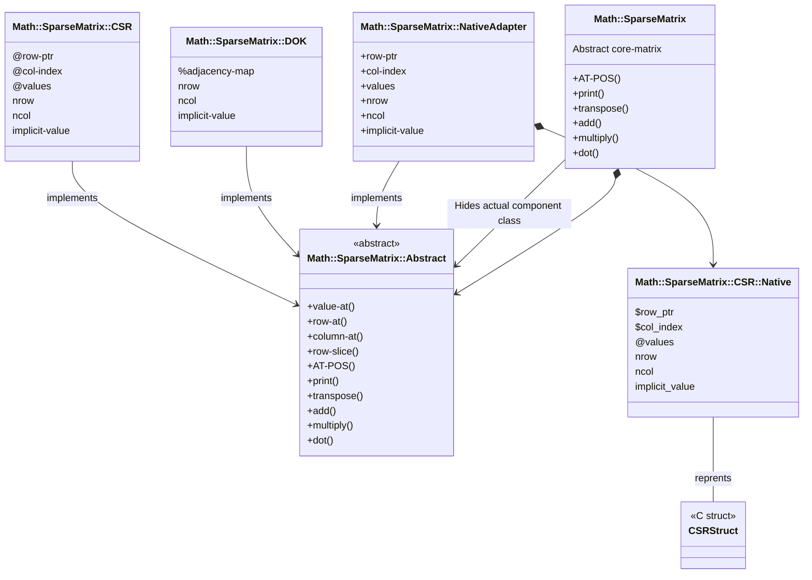

# Math::SparseMatrix


[](https://github.com/antononcube/Raku-Math-SparseMatrix/actions)
[](https://github.com/antononcube/Raku-Math-SparseMatrix/actions)
[](https://github.com/antononcube/Raku-Math-SparseMatrix/actions)

[](https://raku.land/zef:antononcube/Math::SparseMatrix)
[](https://opensource.org/licenses/Artistic-2.0)


Raku package for sparse matrix algorithms:

- Implements (some of) the algorithms described (and spelled-out in FORTRAN) in the book 
"Sparse Matrix Technology" by S. Pissanetzky, [SP1].

- Provides convenient interface to accessing sparse matrix elements, rows, column, and sub-matrices. 

-----

## Motivation

Sparse Matrix Algebra (SMA) is a "must have" for many computational workflows. 
Here is a (non-exhaustive) list given in the order of _my_ preferences:

- Recommendation Systems (RS)
    - I make recommenders often during Exploratory Data Analysis (EDA).
    - For me, RS are "first order regression."
    - I also specialize in the making of RS.
    - I implemented a Raku recommender without SMA, 
      ["ML::StreamsBlendingRecommender"](https://github.com/antononcube/Raku-ML-StreamsBlendingRecommender), [AAp1], 
      but it is too slow for "serious" datasets.
      - Still useful; see [AAv1].
- Latent Semantic Analysis (LSA)
    - LSA is one my favorite Unsupervised Machine Learning (ML) workflows.
    - That means that this SMA package should have algorithms facilitating the programming of:
        - Singular Value Decomposition (SVD)
        - Non-Negative Matrix Factorization (NNMF)
- Graphs
    - There is a natural (representation) connection between sparse matrices and graphs.
    - Many graph algorithms can leverage (fast) SMA.
    - So far (2024-09-25) the algorithms in "Graph", [AAp2], do not use SMA and that is feature- and speed limiting.
- Optimization
    - For large scale optimization problems using SMA is a must.
        - Since their constraints are given with sparse matrices.
- Partial Differential Equations (PDE) solving

-----

## Usage examples

Here is a _simple_ sparse matrix in Compressed Sparse Row (CSR) format:

```perl6
use Math::SparseMatrix;
use Math::SparseMatrix::Utilities;

my $nrow = 5;
my $ncol = 8;
my $density = 0.2;
my $tol = 0.01;
my $type = 'CSR';

my $matrix1 = generate-random-sparse-matrix($nrow, $ncol, :$density, :$tol, :$type):!decorated;
say $matrix1;
```
```
# Math::SparseMatrix::CSR(:specified-elements(8), :dimensions((5, 8)), :density(0.2))
```

Here it is "pretty printed": 

```perl6
$matrix1.print;
```
```
# .    .    0.47 .    0.77 .    .    .   
# .    0.78 .    0.99 .    .    0.54 .   
# .    .    .    .    .    .    .    .   
# .    .    .    .    .    0.07 .    0.39
# .    .    .    .    .    .    0.37 .
```

Here `10` is multiplied with all elements:

```perl6
my $matrix2 = $matrix1.multiply(10); 

$matrix2.print;
```
```
# .   .   4.7 .   7.7 .   .   .  
# .   7.8 .   9.9 .   .   5.4 .  
# .   .   .   .   .   .   .   .  
# .   .   .   .   .   0.7 .   3.9
# .   .   .   .   .   .   3.7 .
```

Here is the dot-product of the original matrix with its transpose:

```perl6
my $matrix3 = $matrix1.dot($matrix1.transpose); 

$matrix3.print;
```
```
# 0.8138 .      .      .      .     
# .      1.8801 .      .      0.1998
# .      .      .      .      .     
# .      .      .      0.157  .     
# .      0.1998 .      .      0.1369
```

-----

## Special features

Here are few features that other SMA packages typically do not provide.

### Named rows and columns

It is very convenient to have named rows and columns that are respected (or preserved)
in the typical SMA operations.

Here is an example:

```perl6
my $smat = Math::SparseMatrix.new($matrix1, row-names => 'a' .. 'e', column-names => 'A' .. 'H'); 

$smat.print;
```
```
# –––––––––––––––––––––––––––––––––––––––––––
#     A    B    C    D    E    F    G    H   
# ––┼––––––––––––––––––––––––––––––––––––––––
# a │ .    .    0.47 .    0.77 .    .    .   
# b │ .    0.78 .    0.99 .    .    0.54 .   
# c │ .    .    .    .    .    .    .    .   
# d │ .    .    .    .    .    0.07 .    0.39
# e │ .    .    .    .    .    .    0.37 .
```


Here is the dot-product of that matrix with its transpose:

```perl6
my $smat2 = $smat.dot($smat.transpose); 

$smat2.round(0.02).print;
```
```
# ––––––––––––––––––––––––––––
#     a    b    c    d    e   
# ––┼–––––––––––––––––––––––––
# a │ 0.82 .    .    .    .   
# b │ .    1.88 .    .    0.2 
# c │ .    .    .    .    .   
# d │ .    .    .    0.16 .   
# e │ .    0.2  .    .    0.14
```

### Implicit value

The sparse matrices can have an _implicit value_ that is different from 0.
For example, adding a number to a sparse matrix produces another sparse matrix 
with different implicit value:

```perl6
my $matrix3 = $matrix1.add(10);
```
```
# Math::SparseMatrix::CSR(:specified-elements(8), :dimensions((5, 8)), :density(0.2))
```

```perl6
$matrix3.implicit-value
```
```
# 10
```

Here is the pretty print:

```perl6
$matrix3.print(:iv)
```
```
# 10    10    10.47 10    10.77 10    10    10   
# 10    10.78 10    10.99 10    10    10.54 10   
# 10    10    10    10    10    10    10    10   
# 10    10    10    10    10    10.07 10    10.39
# 10    10    10    10    10    10    10.37 10
```

**Remark:** Currently, the implicit values are ignored in `dot`.

-----

## Design

### General

- There should be a "main" class, `Math::SpareMatrix` that:
  - Provides the SMA functionalities
  - Delegates to concrete sparse matrix classes that are based on different representation formats
  - Can have named rows, columns, and dimensions
  - Gives access to sparse matrix elements, rows, columns, and sub-matrices
- The default or "main" core sparse matrix class should use Compressed Sparse Row (CSR) format.
- Also, a class using Dictionary Of Keys (DOK) format should be provided.
- The core sparse matrix classes do not have named rows, columns, and dimensions.
- Ideally, a class using `NativeCall` should be implemented at some point.
  - It looks like this is "a must", since the CSR and DOK classes are fairly slow.
  - Both "plain C" and macOS [Accelerate](https://developer.apple.com/accelerate/) implementations should be made.
- The _most important operation_ is Matrix-Vector Dot Product.
  - The current design is to use one-row or one-column matrices for the vectors.
  - Dense vectors are (of course) also supported

### Object-Oriented Programming (OOP) architecture

- The OOP [Decorator Design Pattern](https://en.wikipedia.org/wiki/Decorator_pattern) is used to organize the SMA functionalities.
- In that pattern:
  - The _Component_ is played by the class [`Math::SparseMatrix::Abstract`](./lib/Math/SparseMatrix/Abstract.rakumod).
  - The _ConcreteComponent_ is played by the classes:
    - [`Math::SparseMatrix::CSR`](./lib/Math/SparseMatrix/CSR.rakumod)
    - [`Math::SparseMatrix::DOK`](./lib/Math/SparseMatrix/DOK.rakumod)
  - The concrete component classes provide the core SMA operations.
  - The _Decorator_ is played by [`Math::SparseMatrix`](./lib/Math/SparseMatrix.rakumod).
    - That is a "top level", interface class.
    - Allows access using named rows and columns.
    - "Hides" the actual component class used.

Here is a corresponding diagram:



### Implementation details

- Again, the most important operation is Matrix-Vector Dot Product.
    - It has to be as fast as possible.
    - There are two Dot Product implementations for CSR:
        - Direct
        - Symbolic-&-numeric
    - (Currently) the direct one is 20-50% faster.
- It seems it is a good idea to provide for some operations _symbolic_ (or sparse matrix elements pattern) methods.
    - For example:
        - `add-pattern` / `add`
        - `dot-pattern` / `dot-numeric`
- It is important to have access methods / operators.
    - All three are used in the accessor implementation: `AT-POS`, `postcircumfix:<[ ]>`, `postcircumfix:<[; ]>` .


-----

## Performance

- Performance of CSR and DOK sparse matrices is not good: between 40 to 150 times slower than Wolfram Language.
  - (Using the same matrices, of course.)
- It is somewhat surprising that DOK is faster than CSR. 
  - (Using pure-Raku.)
- `NativeCall` based implementations are ≈ 100 times faster.
  - See ["Math::SparseMatrix::NativeCall"](https://github.com/antononcube/Raku-Math-SparseMatrix-Native), [AAp3].

-----

## Acknowledgements

Thanks to [@lizmat](https://github.com/lizmat) and [@tony-o](https://github.com/tony-o) for helping figuring out the proper use of `postcircumfix:<[]>` and `postcircumfix:<[; ]>`
in order to have the named rows and columns functionalities.

-----

## References

### Books

[SP1] Sergio Pissanetzky, Sparse Matrix Technology, Academic Pr (January 1, 1984), ISBN-10: 0125575807, ISBN-13: 978-0125575805.

### Packages

[AAp1] Anton Antonov,
[ML::StreamsBlendingRecommender Raku package](https://github.com/antononcube/Raku-ML-StreamsBlendingRecommender), 
(2021-2024),
[GitHub/antononcube](https://github.com/antononcube).

[AAp2] Anton Antonov,
[Graph Raku package](https://github.com/antononcube/Raku-Graph),
(2024),
[GitHub/antononcube](https://github.com/antononcube).

[AAp3] Anton Antonov,
[Math::SparseMatrix::NativeCAll Raku package](https://github.com/antononcube/Raku-Math-SparseMatrix-Native),
(2024),
[GitHub/antononcube](https://github.com/antononcube).

### Videos

[AAv1] Anton Antonov,
["TRC 2022 Implementation of ML algorithms in Raku"](https://youtu.be/efRHfjYebs4?si=J5P8pK1TgGSxdlmD&t=193),
(2022),
[YouTube/antononcube](https://www.youtube.com/@AAA4prediction).